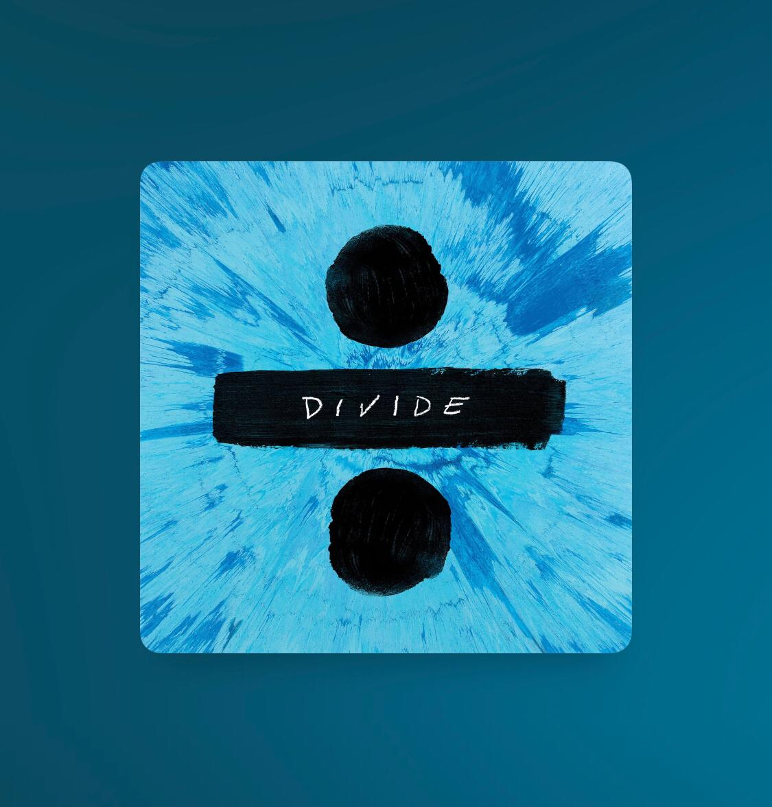

# Apple Music Dynamic Background

## From Apple

## Generated In React

In Apple Music we can see that the background is not the album blurred, the background it`s a way more complex and use a set of dominant colors to be generated. Therefore to create that fancy background it was need a grid under a glassmorphism div. That grid consists in a randomize set of the most dominant colors of the image.

